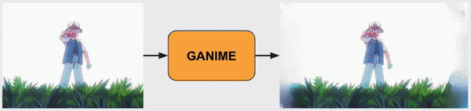
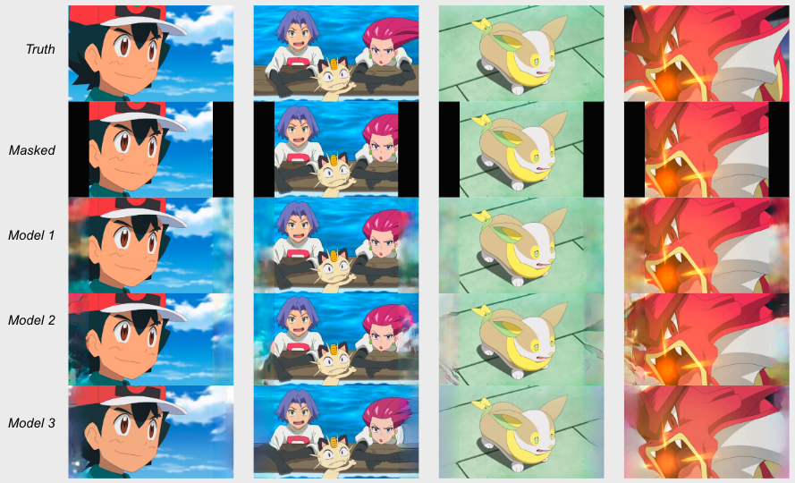
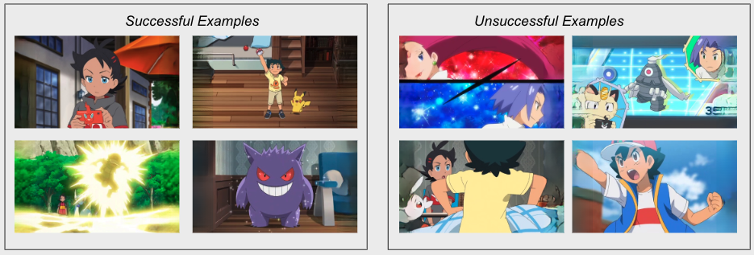

### GANIME (**Generative Adversarial Networks In Motion Entertainment**)

GANime explores a series of GAN methods for converting old 4:3 aspect ratio anime to 16:9 by using image inpainting.

In this repo I created 3 different models based on 3 papers to explore how well their methods work. The papers I used are the following:

_Context Encoders: Feature Learning by Inpainting (Pathak, Krähenbühl, Donahue, Darrell, Efros) CVPR 2016_

_Globally and Locally Consistent Image Completion (Iizuka, Simo-Serra, Ishikawa) ACM Transactions on Graphics 2017_

_Resolution-robust Large Mask Inpainting with Fourier Convolutions - LaMa (Suvorov, Logacheva, Mashikhin, Remizova, Ashukha, Silvestrov, Kong, Goka, Park, Lempitsky) WACV 2022_

## Why

Traditional conversion of animation to 16:9 involves cropping out the top and bottom of the video, sometimes removing context, such as the joke being cut out of the example below.

**Why GANs and not Stable Diffusion?**

When I started this project Stable Diffusion hadn't taken off yet. Also, the name GANIME was too perfect to pass up!

## Data

I chose to keep the training set to that of the Pokemon series. I did this for two reasons. First, Pokemon has episodes that are in both 4:3 and 16:9 format. Second, this keeps the style and color pallet to a single show, minimizing the amount of generalization the models will have to do.

## Code, Training, and Logging

I coded all models from scratch using Pytorch (with the exception of LaMa).
Training was done using Google Colab Pro which provided an NVIDIA Tesla V100 that has ~7.5 Teraflops. Results were logged and visualized using TensorBoard.

## Results

### Still Images

<small>_Output from each of the three models_</small>

Model 1 does very little beyond just extending blurred colors into the masked area.

Model 2 included the addition of dilation and the use of a local and global discriminator.
Overall results are much better and we see some sense of object completion, such as Ash's ear.

Model 3 or the LaMa model does the best especially when it comes to identifying patterns. This is because the LaMa model uses Fourier Convolutions that essentially identify repeating patterns in images. Below are some of the best and worst cases from Model 3.

Model 3 does well with patterns such as the wood flooring, but struggles with faces or anatomy.

### LPIP scores

LPIPS (Learned Perceptual Image Patch Similarity) is a metric used for calculating the effectiveness of image inpainting. This loss is calculated on the difference of feature vectors of the images and not the difference of the pixels. Not surprisingly, the LaMa model has the best LPIPS score.

| &nbsp;     | Model 1 | Model 2 | Model 3 |
| ---------- | ------- | ------- | ------- |
| LPIP Score | 0.146   | 0.139   | 0.099   |

### Video

So how does this look when applied to video? It's about how you'd expect. One of the main issues is the flickering or temporal inconsistencies in the images. Next steps should include investigating methods that can be used to take into account the sequential aspect of the images

Results are not half bad on some instances of Pokemon. However, when we move further away from the domain of the training data, such as the Simpson or even live action like The Wizard of Oz, the model appears to struggle more.
