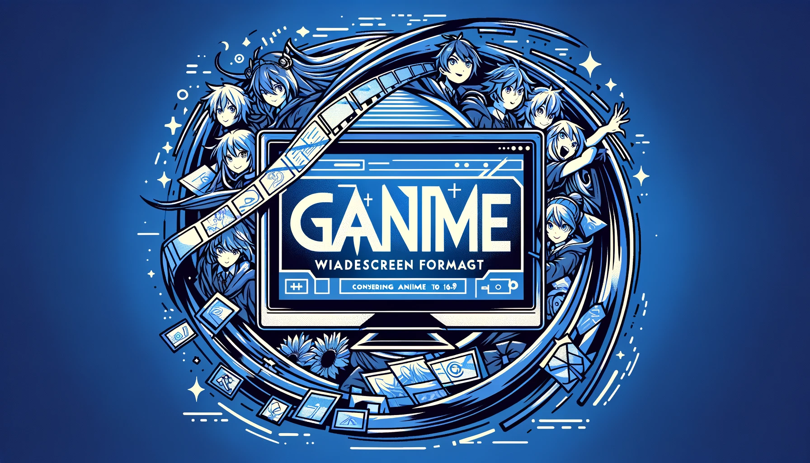
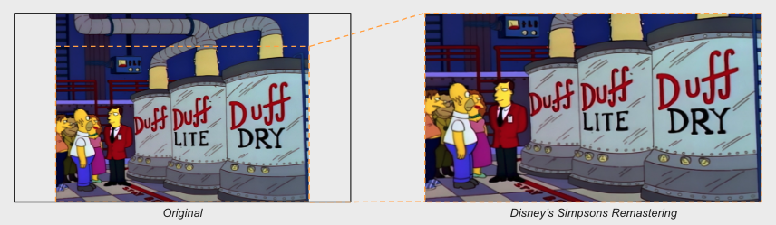
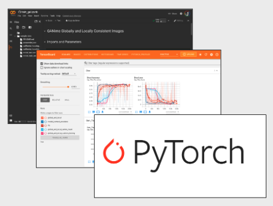

<small>_generated with DALL-E_</small>

### GANIME

Using Generative Advisarial Networks to convert anime from 4:3 to 16:9

## What is this repo?

GANime explores a sereis of methods for converting old 4:3 aspect ratio anime to 16:9. In this repo I go through 3 different methods from papers explor how well they work .The papares I used are the following:

_Context Encoders: Feature Learning by Inpainting (Pathak, Krähenbühl, Donahue, Darrell, Efros) CVPR 2016_

_Globally and Locally Consistent Image Completion (Iizuka, Simo-Serra, Ishikawa) ACM Transactions on Graphics 2017_

_Resolution-robust Large Mask Inpainting with Fourier Convolutions - LaMa (Suvorov, Logacheva, Mashikhin, Remizova, Ashukha, Silvestrov, Kong, Goka, Park, Lempitsky) WACV 2022_

## Why

Traditional convertion of animation to 16:9 involves cropping out the top and bottom of the video, sometimes removing context, such as the joke being cut out of the example below.

## How

### Data

I chose to keep the training set to that of the Pokemon anime. I did this for two reason. First, Pokemon has episodes that are in both 4:3 and 16:9 format. Second, this kept the style and color pallet to a single show meaning that the model won't have to generalize as much.

### Code & Tech Stack

I coded all models from scratch using Pytorch (with the exception of LaMa).
Training was done using Google Colab Pro which provided an NVIDIA Tesla V100 that has ~7.5 Teraflops. Results were logged and visualized using TensorBoard.

## Results

## Challenges we ran into

getting the models to train correctly
scaling images correctly so that spot checking was correctly showing what I was seeing

Generator being too good
https://github.com/magenta/magenta/blob/main/magenta/reviews/GAN.md

## Methods

## Shortcoming and next steps

## Overview

Prior to 2009, most television was done in 4:3 aspect ratio, opposed to the current standard of 16:9. GANIME takes in old anime in 4:3 aspect ratio and converts it to 16:9 by generating feasible animation for the sides.

## Methodology

### Data

For data, still frame images where taken from the Fullmetal Alchemist (2003) and Fullmetal Alchemist Brotherhood (2009) anime series. Both are adaptations of the same manga and share almost identical visual styles. However, the 2003 version is in a 4:3 aspect ratio and the 2009 version is in 16:9. From here we trained the GANs on the 16:9 frames. These images were cropped to 4:3 and feed to the generator (I'm using the word cropped, but in reality the image still extends the same ammount but the values have all been set to 0). With an image size of 256, this ammounts to 32 pixels on each side being zeroed out. The generated result along with the original 16:9 image were then given the discriminator to try to distinguish between the real and fake 16:9 image. After the GANs were sufficiently trained, we reviewed the generator results on the 2003 series's 4:3 frames.

### Model

- architecture: using a 256 size
- cost functions
  - Image difference
- stoping condition
  - can just be image simmilarity, when that score discontinues to improve.
- metrics
  - Gen Loss
  - Disc Loss
  - Image simmilarity

## Notebooks

- process_freams.ipynb: Takes the video files and converts them to frames.
- model_baseline_01.ipynb: This is the anime faces GANS project used as a refference.
- model_gans.ipynb: Notebook with the model trained on frames from anime.

## Backlog

- Add the local discriminator
- Have the images load to the cuda from the start

## Results to show

- Results over time
- Example on the 16:9
- Example on the 4:3
  - fixed background vs action sceen
- Show examples of other shows (Simpsons, Cowboy Bebop, Wizard of Oz)

## Links and Literature

Berkey's project of filling in missing information from images. http://people.eecs.berkeley.edu/~pathak/context_encoder/#extraResults

Medium article reviewing different types of inpainting https://towardsdatascience.com/10-papers-you-must-read-for-deep-image-inpainting-2e41c589ced0

Globally and Locally Consistent Inpainting http://iizuka.cs.tsukuba.ac.jp/projects/completion/data/completion_sig2017.pdf

- Some tests were run on 100k images for 500 epochs
- How is masking done? The input of the completion network is an RGB image with a binary channel that indicates the image completion mask (1 for a pixel to be completed)
- They did do some networks with just weighted MSE (what is the weighting?)
- Look into this [repo](https://github.com/sevmardi/gl_Image_Inapinting_pytorch/blob/master/net_gl.py) that recreates Globally and Locally Consistent Image Completion in pytorch

Looked into OpenAI's Image GPT (https://openai.com/blog/image-gpt/). It may take too long to train even if it's just transfer learning on this model.

- Code is on github (https://github.com/openai/image-gpt). Was created with TensorFlow.
  30 is the largest batch size
